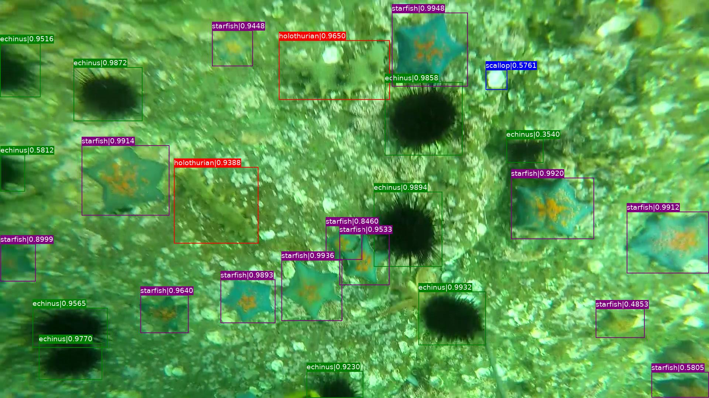

# under-water-detect

## Baseline

* htc_r50_fpn_20e_coco [config](https://open-mmlab.oss-cn-beijing.aliyuncs.com/v2.0/htc/htc_r50_fpn_20e_coco/htc_r50_fpn_20e_coco_20200319-fe28c577.pth), [pretrained model](http://download.openmmlab.com/mmdetection/v2.0/htc/htc_r50_fpn_20e_coco/htc_r50_fpn_20e_coco_20200319-fe28c577.pth)
* htc_x101_64x4d_fpn_16x1_20e_coco [config](https://github.com/open-mmlab/mmdetection/tree/master/configs/htc/htc_x101_64x4d_fpn_16x1_20e_coco.py), [pretrained model](http://download.openmmlab.com/mmdetection/v2.0/htc/htc_x101_64x4d_fpn_16x1_20e_coco/htc_x101_64x4d_fpn_16x1_20e_coco_20200318-b181fd7a.pth)
* htc_x101_64x4d_fpn_dconv_c3-c5_mstrain_400_1400_16x1_20e_coco [config](https://github.com/open-mmlab/mmdetection/tree/master/configs/htc/htc_x101_64x4d_fpn_dconv_c3-c5_mstrain_400_1400_16x1_20e_coco.py), [pretrained model](http://download.openmmlab.com/mmdetection/v2.0/htc/htc_x101_64x4d_fpn_dconv_c3-c5_mstrain_400_1400_16x1_20e_coco/htc_x101_64x4d_fpn_dconv_c3-c5_mstrain_400_1400_16x1_20e_coco_20200312-946fd751.pth)


## EDA
* [data analysis](./docs/data_analysis.ipynb)

* [check data](./docs/check_and_draw_box.ipynb)

## 数据集处理
### load dataset
<https://code.ihub.org.cn/projects/1372/files>

### convert xml to json
```shell script
python tools/data_process/xml2coco.py
```
### generate pseudo json label of test image 
```shell script
python tools/data_process/generate_test_anns.py
```

## 设计思路

### 模型配置

| 配置 | 设置 |
| :-----:| :----: 
| 模型 | CascadeRCNN + ResNeXt101 + FPN | 
| anchor_ratio | (0.5, 1, 2) | 
| 多尺度训练(MS)|(4096, 600), (4096, 1200)| 
| 多尺度预测(MS)|(4096, 600), (4096, 1000), (4096, 1200)|
| soft-NMS| (iou_thr=0.5, min_score=0.0001)|
| epoch| 1 x schedule(12 epoch)|
| steps| [8, 12]|
| fp16|开启|
| DCN|True|
| GC|True|
| data-augmentation|Albumentations, MixUP, Retinex, Rotation|

| pretrained|Hybrid Task Cascade(HTC)|

### lr computer

$ lr = 0.00125 \times \text{num_gpus} \times \text{img_per_gpu} $

### data augmentation

* Albumentations
* MixUp
 
### DCN

### GC

使用[GC(Global Context ROI)](./mmdet/models/roi_heads/roi_extractors/single_level_roi_extractor.py)为每个候选框添加上下文信息，充分利用数据分布特点，提升了检测精度。


## Training

```shell script
python ./tools/train.py configs/cascade_r50_fpn_1x.py --no-validate --gpus=1
```

## Inference

* save bbox to pickle(optional) 
```shell script
python tools/custom.py  configs/cascade_r50_fpn_1x.py outputs/htc_rcnn_r50_fpn_1x/latest.pth  --format-only  --out results/cascad_r50.pkl 

```
* save bbox to pickle and draw box to image(optional)
```shell script
python tools/custom.py configs/cascade_r50_fpn_1x.py outputs/htc_rcnn_r50_fpn_1x/latest.pth --format-only --out results/cascad_r50.pkl  --show --show-dir results/box_image

```
* save bbox to json format
```shell script
python tools/custom_test.py  configs/cascade_r50_fpn_1x.py outputs/htc_rcnn_r50_fpn_1x/latest.pth  --format-only  --json_out results/cascade_r50
```

## generate submit file
```shell script
python tools/post_process/json2submit.py --test-json results/cascade_r50.bbox.json --submit-file submmit/cascade_r50.csv

```

## test-demo
```shell script
python tools/post_process/detect_demo.py
```
<table>
    <tr>
        <td ><center> 测试图片 </center></td>
        <td ><center> 检测图片 </center></td>
    </tr>
 
</table>

## Trick

## Log

### train log

### error log (loss NAN)
```shell script
2021-01-25 19:25:22,220 - mmdet - INFO - workflow: [('train', 1)], max: 12 epochs
2021-01-25 19:25:44,459 - mmdet - INFO - Epoch [1][50/5455]	lr: 4.983e-04, eta: 8:02:25, time: 0.443, data_time: 0.047, memory: 3654, loss_rpn_cls: 0.1925, loss_rpn_bbox: 0.0304, s0.loss_cls: 0.5629, s0.acc: 87.7969, s0.loss_bbox: 0.1178, s1.loss_cls: 0.2588, s1.acc: 90.2930, s1.loss_bbox: 0.0968, s2.loss_cls: 0.1165, s2.acc: 94.1406, s2.loss_bbox: 0.0351, loss: 1.4106, grad_norm: 10.6679
2021-01-25 19:26:04,422 - mmdet - INFO - Epoch [1][100/5455]	lr: 5.817e-04, eta: 7:38:30, time: 0.399, data_time: 0.003, memory: 3654, loss_rpn_cls: 0.0565, loss_rpn_bbox: 0.0194, s0.loss_cls: 0.2479, s0.acc: 92.6836, s0.loss_bbox: 0.1215, s1.loss_cls: 0.1272, s1.acc: 91.4200, s1.loss_bbox: 0.1315, s2.loss_cls: 0.0633, s2.acc: 92.3482, s2.loss_bbox: 0.0634, loss: 0.8306, grad_norm: 6.3832
2021-01-25 19:26:21,410 - mmdet - INFO - Epoch [1][150/5455]	lr: 6.650e-04, eta: 7:08:42, time: 0.340, data_time: 0.003, memory: 3654, loss_rpn_cls: 0.0738, loss_rpn_bbox: 0.0234, s0.loss_cls: 0.2896, s0.acc: 91.3672, s0.loss_bbox: 0.1508, s1.loss_cls: 0.1442, s1.acc: 91.0758, s1.loss_bbox: 0.1669, s2.loss_cls: 0.0735, s2.acc: 89.6029, s2.loss_bbox: 0.0791, loss: 1.0013, grad_norm: 8.8747
2021-01-25 19:26:37,296 - mmdet - INFO - Epoch [1][200/5455]	lr: 7.483e-04, eta: 6:47:40, time: 0.318, data_time: 0.003, memory: 3654, loss_rpn_cls: 0.0615, loss_rpn_bbox: 0.0221, s0.loss_cls: 0.2475, s0.acc: 93.0781, s0.loss_bbox: 0.1243, s1.loss_cls: 0.1164, s1.acc: 93.5012, s1.loss_bbox: 0.1407, s2.loss_cls: 0.0559, s2.acc: 93.1238, s2.loss_bbox: 0.0658, loss: 0.8342, grad_norm: 7.5786
2021-01-25 19:26:53,736 - mmdet - INFO - Epoch [1][250/5455]	lr: 8.317e-04, eta: 6:37:21, time: 0.329, data_time: 0.003, memory: 3672, loss_rpn_cls: 0.0812, loss_rpn_bbox: 0.0254, s0.loss_cls: 0.2639, s0.acc: 92.2188, s0.loss_bbox: 0.1250, s1.loss_cls: 0.1282, s1.acc: 92.6880, s1.loss_bbox: 0.1348, s2.loss_cls: 0.0610, s2.acc: 92.6380, s2.loss_bbox: 0.0637, loss: 0.8832, grad_norm: 7.2209
2021-01-25 19:27:09,358 - mmdet - INFO - Epoch [1][300/5455]	lr: 9.150e-04, eta: 6:27:25, time: 0.312, data_time: 0.003, memory: 3672, loss_rpn_cls: 0.6478, loss_rpn_bbox: 0.0342, s0.loss_cls: nan, s0.acc: 14.7109, s0.loss_bbox: nan, s1.loss_cls: nan, s1.acc: 14.4101, s1.loss_bbox: nan, s2.loss_cls: nan, s2.acc: 14.3531, s2.loss_bbox: nan, loss: nan, grad_norm: nan
2021-01-25 19:27:24,706 - mmdet - INFO - Epoch [1][350/5455]	lr: 9.983e-04, eta: 6:19:25, time: 0.307, data_time: 0.003, memory: 3763, loss_rpn_cls: 0.7337, loss_rpn_bbox: 0.0419, s0.loss_cls: nan, s0.acc: 0.1523, s0.loss_bbox: nan, s1.loss_cls: nan, s1.acc: 2.6650, s1.loss_bbox: nan, s2.loss_cls: nan, s2.acc: 2.4035, s2.loss_bbox: nan, loss: nan, grad_norm: nan
2021-01-25 19:27:41,646 - mmdet - INFO - Epoch [1][400/5455]	lr: 1.082e-03, eta: 6:17:39, time: 0.339, data_time: 0.003, memory: 3763, loss_rpn_cls: 0.7058, loss_rpn_bbox: 0.0391, s0.loss_cls: nan, s0.acc: 0.0742, s0.loss_bbox: nan, s1.loss_cls: nan, s1.acc: 0.4444, s1.loss_bbox: nan, s2.loss_cls: nan, s2.acc: 3.6349, s2.loss_bbox: nan, loss: nan, grad_norm: nan
2021-01-25 19:27:57,810 - mmdet - INFO - Epoch [1][450/5455]	lr: 1.165e-03, eta: 6:14:21, time: 0.323, data_time: 0.003, memory: 3763, loss_rpn_cls: 0.6784, loss_rpn_bbox: 0.0438, s0.loss_cls: nan, s0.acc: 0.1875, s0.loss_bbox: nan, s1.loss_cls: nan, s1.acc: 1.7714, s1.loss_bbox: nan, s2.loss_cls: nan, s2.acc: 2.1500, s2.loss_bbox: nan, loss: nan, grad_norm: nan
2021-01-25 19:28:13,354 - mmdet - INFO - Epoch [1][500/5455]	lr: 1.248e-03, eta: 6:10:19, time: 0.311, data_time: 0.003, memory: 3763, loss_rpn_cls: 0.6525, loss_rpn_bbox: 0.0467, s0.loss_cls: nan, s0.acc: 0.0703, s0.loss_bbox: nan, s1.loss_cls: nan, s1.acc: 1.0330, s1.loss_bbox: nan, s2.loss_cls: nan, s2.acc: 0.6964, s2.loss_bbox: nan, loss: nan, grad_norm: nan
2021-01-25 19:28:30,701 - mmdet - INFO - Epoch [1][550/5455]	lr: 1.250e-03, eta: 6:10:30, time: 0.347, data_time: 0.003, memory: 3763, loss_rpn_cls: 0.6215, loss_rpn_bbox: 0.0336, s0.loss_cls: nan, s0.acc: 0.0625, s0.loss_bbox: nan, s1.loss_cls: nan, s1.acc: 1.1000, s1.loss_bbox: nan, s2.loss_cls: nan, s2.acc: 0.3000, s2.loss_bbox: nan, loss: nan, grad_norm: nan
2021-01-25 19:28:46,898 - mmdet - INFO - Epoch [1][600/5455]	lr: 1.250e-03, eta: 6:08:33, time: 0.324, data_time: 0.003, memory: 3763, loss_rpn_cls: 0.5968, loss_rpn_bbox: 0.0351, s0.loss_cls: nan, s0.acc: 2.0742, s0.loss_bbox: nan, s1.loss_cls: nan, s1.acc: 0.3676, s1.loss_bbox: nan, s2.loss_cls: nan, s2.acc: 1.7367, s2.loss_bbox: nan, loss: nan, grad_norm: nan
2021-01-25 19:29:04,411 - mmdet - INFO - Epoch [1][650/5455]	lr: 1.250e-03, eta: 6:09:02, time: 0.350, data_time: 0.003, memory: 3763, loss_rpn_cls: 0.5764, loss_rpn_bbox: 0.0393, s0.loss_cls: nan, s0.acc: 2.0664, s0.loss_bbox: nan, s1.loss_cls: nan, s1.acc: 0.6667, s1.loss_bbox: nan, s2.loss_cls: nan, s2.acc: 2.3714, s2.loss_bbox: nan, loss: nan, grad_norm: nan
2021-01-25 19:29:22,212 - mmdet - INFO - Epoch [1][700/5455]	lr: 1.250e-03, eta: 6:09:52, time: 0.356, data_time: 0.003, memory: 3763, loss_rpn_cls: 0.5571, loss_rpn_bbox: 0.0401, s0.loss_cls: nan, s0.acc: 0.0586, s0.loss_bbox: nan, s1.loss_cls: nan, s1.acc: 3.4667, s1.loss_bbox: nan, s2.loss_cls: nan, s2.acc: 1.3889, s2.loss_bbox: nan, loss: nan, grad_norm: nan
2021-01-25 19:29:41,731 - mmdet - INFO - Epoch [1][750/5455]	lr: 1.250e-03, eta: 6:13:00, time: 0.390, data_time: 0.003, memory: 3811, loss_rpn_cls: 0.5406, loss_rpn_bbox: 0.0409, s0.loss_cls: nan, s0.acc: 0.0742, s0.loss_bbox: nan, s1.loss_cls: nan, s1.acc: 1.5111, s1.loss_bbox: nan, s2.loss_cls: nan, s2.acc: 1.0667, s2.loss_bbox: nan, loss: nan, grad_norm: nan
2021-01-25 19:29:59,933 - mmdet - INFO - Epoch [1][800/5455]	lr: 1.250e-03, eta: 6:13:56, time: 0.364, data_time: 0.003, memory: 3858, loss_rpn_cls: 0.5265, loss_rpn_bbox: 0.0438, s0.loss_cls: nan, s0.acc: 1.5273, s0.loss_bbox: nan, s1.loss_cls: nan, s1.acc: 3.2214, s1.loss_bbox: nan, s2.loss_cls: nan, s2.acc: 1.3485, s2.loss_bbox: nan, loss: nan, grad_norm: nan
2021-01-25 19:30:18,538 - mmdet - INFO - Epoch [1][850/5455]	lr: 1.250e-03, eta: 6:15:14, time: 0.372, data_time: 0.003, memory: 3858, loss_rpn_cls: 0.5190, loss_rpn_bbox: 0.0485, s0.loss_cls: nan, s0.acc: 0.0430, s0.loss_bbox: nan, s1.loss_cls: nan, s1.acc: 2.2333, s1.loss_bbox: nan, s2.loss_cls: nan, s2.acc: 2.6553, s2.loss_bbox: nan, loss: nan, grad_norm: nan
2021-01-25 19:30:35,671 - mmdet - INFO - Epoch [1][900/5455]	lr: 1.250e-03, eta: 6:14:36, time: 0.343, data_time: 0.003, memory: 3858, loss_rpn_cls: 0.5023, loss_rpn_bbox: 0.0420, s0.loss_cls: nan, s0.acc: 0.0430, s0.loss_bbox: nan, s1.loss_cls: nan, s1.acc: 1.5000, s1.loss_bbox: nan, s2.loss_cls: nan, s2.acc: 0.1905, s2.loss_bbox: nan, loss: nan, grad_norm: nan
2021-01-25 19:30:53,774 - mmdet - INFO - Epoch [1][950/5455]	lr: 1.250e-03, eta: 6:15:06, time: 0.362, data_time: 0.003, memory: 3858, loss_rpn_cls: 0.4698, loss_rpn_bbox: 0.0266, s0.loss_cls: nan, s0.acc: 2.0508, s0.loss_bbox: nan, s1.loss_cls: nan, s1.acc: 2.2714, s1.loss_bbox: nan, s2.loss_cls: nan, s2.acc: 1.5000, s2.loss_bbox: nan, loss: nan, grad_norm: nan
2021-01-25 19:31:10,917 - mmdet - INFO - Exp name: cascade_r50_fpn_1x.py
```
* acknowledge
[Compatibility with MMDetection 1.x](https://github.com/open-mmlab/mmdetection/blob/master/docs/compatibility.md)
[Loss becomes NAN after a few iterations](https://github.com/open-mmlab/mmdetection/issues/2739)
* check if the dataset annotations are correct
* reduce the learning rate
* extend the warmup iterations
* add gradient clipping

* method
    * 数据清理: 确保gt_box的边框不超过图片尺度的大小[check_and_draw_box](./docs/check_and_draw_box.ipynb)
    * num_classes 大小设置: mmedetection  v1 与 v2 版本的 num_classes 配置策略不同, 在v1中 num_classes 设置为**真实类别数+1**, 在v2中 num_classes 直接设置为**真实类别数**。以4分类目标检测为例， v1中设置为num_classes=5，背景的标签默认为0. mmdet_v2 中设置为num_classes=4. 这里需要修改[配置文件](./configs/cascade_r50_fpn_1x.py)中**num_classes**的个数
    * 真实类label映射的设置：假设数据即中真实的类别标签个数为k, 在 mmdet_v1 中真实类标签的label的范围为**[1, k-1]**， 背景对应的label为0; mmdet_v2中真实的类标签的label范围为**[0, k-1]**), 背景对应的label为k, 这里需要修改数据集处理涉及的两个文件[xml2coco.py](./tools/data_process/xml2coco.py)和[xml2co.py](./tools/generate_test_anns.py/generate_test_anns.py)
    * **同时注意修改自定义数据集模块 [under_warter](./mmdet/datasets/under_warter.py)中 cat_id 字典映射的值**
 
* normal training log
```shell script
2021-01-27 14:28:46,566 - mmdet - INFO - Epoch [1][50/5455]     lr: 4.575e-04, eta: 6:27:11, time: 0.355, data_time: 0.044, memory: 2883, loss_rpn_cls: 0.1894, loss_rpn_bbox: 0.0234, s0.loss_cls: 0.5640, s0.acc: 86.2930, s0.loss_bbox: 0.1310, s1.loss_cls: 0.2852, s1.acc: 87.2617, s1.loss_bbox: 0.1273, s2.loss_cls: 0.1486, s2.acc: 84.3984, s2.loss_bbox: 0.0620, loss: 1.5311, grad_norm: 10.7843
2021-01-27 14:29:03,221 - mmdet - INFO - Epoch [1][100/5455]    lr: 4.992e-04, eta: 6:14:52, time: 0.333, data_time: 0.003, memory: 2991, loss_rpn_cls: 0.0582, loss_rpn_bbox: 0.0216, s0.loss_cls: 0.3655, s0.acc: 89.7930, s0.loss_bbox: 0.1517, s1.loss_cls: 0.1838, s1.acc: 89.2545, s1.loss_bbox: 0.1659, s2.loss_cls: 0.0920, s2.acc: 89.5611, s2.loss_bbox: 0.0792, loss: 1.1180, grad_norm: 8.1030
2021-01-27 14:29:21,266 - mmdet - INFO - Epoch [1][150/5455]    lr: 5.408e-04, eta: 6:20:40, time: 0.361, data_time: 0.003, memory: 3167, loss_rpn_cls: 0.0611, loss_rpn_bbox: 0.0260, s0.loss_cls: 0.3486, s0.acc: 90.2891, s0.loss_bbox: 0.1483, s1.loss_cls: 0.1843, s1.acc: 90.1845, s1.loss_bbox: 0.1763, s2.loss_cls: 0.0958, s2.acc: 87.4858, s2.loss_bbox: 0.0954, loss: 1.1358, grad_norm: 8.2759
2021-01-27 14:29:37,638 - mmdet - INFO - Epoch [1][200/5455]    lr: 5.825e-04, eta: 6:14:18, time: 0.327, data_time: 0.003, memory: 3167, loss_rpn_cls: 0.0456, loss_rpn_bbox: 0.0199, s0.loss_cls: 0.2940, s0.acc: 91.1836, s0.loss_bbox: 0.1595, s1.loss_cls: 0.1474, s1.acc: 91.1392, s1.loss_bbox: 0.1807, s2.loss_cls: 0.0749, s2.acc: 89.8128, s2.loss_bbox: 0.0896, loss: 1.0116, grad_norm: 8.7904
2021-01-27 14:29:54,112 - mmdet - INFO - Epoch [1][250/5455]    lr: 6.242e-04, eta: 6:10:50, time: 0.329, data_time: 0.003, memory: 3167, loss_rpn_cls: 0.0616, loss_rpn_bbox: 0.0229, s0.loss_cls: 0.3396, s0.acc: 90.1016, s0.loss_bbox: 0.1689, s1.loss_cls: 0.1681, s1.acc: 90.1626, s1.loss_bbox: 0.1896, s2.loss_cls: 0.0809, s2.acc: 89.6185, s2.loss_bbox: 0.0886, loss: 1.1204, grad_norm: 8.5572
2021-01-27 14:30:09,856 - mmdet - INFO - Epoch [1][300/5455]    lr: 6.658e-04, eta: 6:05:47, time: 0.315, data_time: 0.003, memory: 3294, loss_rpn_cls: 0.0576, loss_rpn_bbox: 0.0242, s0.loss_cls: 0.3399, s0.acc: 89.6680, s0.loss_bbox: 0.1531, s1.loss_cls: 0.1666, s1.acc: 89.6995, s1.loss_bbox: 0.1789, s2.loss_cls: 0.0834, s2.acc: 89.4767, s2.loss_bbox: 0.0937, loss: 1.0975, grad_norm: 9.3588
2021-01-27 14:30:25,360 - mmdet - INFO - Epoch [1][350/5455]    lr: 7.075e-04, eta: 6:01:21, time: 0.310, data_time: 0.003, memory: 3294, loss_rpn_cls: 0.0423, loss_rpn_bbox: 0.0186, s0.loss_cls: 0.2601, s0.acc: 92.3125, s0.loss_bbox: 0.1421, s1.loss_cls: 0.1329, s1.acc: 92.1073, s1.loss_bbox: 0.1720, s2.loss_cls: 0.0665, s2.acc: 91.0645, s2.loss_bbox: 0.0848, loss: 0.9194, grad_norm: 8.0573
2021-01-27 14:30:42,014 - mmdet - INFO - Epoch [1][400/5455]    lr: 7.492e-04, eta: 6:01:05, time: 0.333, data_time: 0.003, memory: 3294, loss_rpn_cls: 0.0519, loss_rpn_bbox: 0.0193, s0.loss_cls: 0.2955, s0.acc: 90.8008, s0.loss_bbox: 0.1469, s1.loss_cls: 0.1461, s1.acc: 91.1423, s1.loss_bbox: 0.1754, s2.loss_cls: 0.0720, s2.acc: 90.7041, s2.loss_bbox: 0.0894, loss: 0.9966, grad_norm: 8.9576
2021-01-27 14:30:59,522 - mmdet - INFO - Epoch [1][450/5455]    lr: 7.908e-04, eta: 6:02:53, time: 0.350, data_time: 0.003, memory: 3294, loss_rpn_cls: 0.0492, loss_rpn_bbox: 0.0219, s0.loss_cls: 0.3002, s0.acc: 90.0391, s0.loss_bbox: 0.1764, s1.loss_cls: 0.1540, s1.acc: 89.8530, s1.loss_bbox: 0.1991, s2.loss_cls: 0.0779, s2.acc: 88.9567, s2.loss_bbox: 0.0972, loss: 1.0761, grad_norm: 9.4154
2021-01-27 14:31:15,622 - mmdet - INFO - Epoch [1][500/5455]    lr: 8.325e-04, eta: 6:01:12, time: 0.322, data_time: 0.003, memory: 3294, loss_rpn_cls: 0.0503, loss_rpn_bbox: 0.0238, s0.loss_cls: 0.3077, s0.acc: 90.6484, s0.loss_bbox: 0.1764, s1.loss_cls: 0.1520, s1.acc: 90.6791, s1.loss_bbox: 0.1946, s2.loss_cls: 0.0765, s2.acc: 89.1524, s2.loss_bbox: 0.1010, loss: 1.0823, grad_norm: 9.1298
2021-01-27 14:31:31,486 - mmdet - INFO - Epoch [1][550/5455]    lr: 8.742e-04, eta: 5:59:19, time: 0.317, data_time: 0.003, memory: 3534, loss_rpn_cls: 0.0517, loss_rpn_bbox: 0.0207, s0.loss_cls: 0.2939, s0.acc: 90.5352, s0.loss_bbox: 0.1649, s1.loss_cls: 0.1489, s1.acc: 90.2281, s1.loss_bbox: 0.1909, s2.loss_cls: 0.0747, s2.acc: 89.2166, s2.loss_bbox: 0.0900, loss: 1.0357, grad_norm: 8.9233
2021-01-27 14:31:48,655 - mmdet - INFO - Epoch [1][600/5455]    lr: 9.158e-04, eta: 6:00:03, time: 0.343, data_time: 0.003, memory: 3534, loss_rpn_cls: 0.0453, loss_rpn_bbox: 0.0207, s0.loss_cls: 0.2646, s0.acc: 91.9805, s0.loss_bbox: 0.1580, s1.loss_cls: 0.1278, s1.acc: 92.1483, s1.loss_bbox: 0.1726, s2.loss_cls: 0.0625, s2.acc: 91.5887, s2.loss_bbox: 0.0820, loss: 0.9336, grad_norm: 8.3732
2021-01-27 14:32:04,554 - mmdet - INFO - Epoch [1][650/5455]    lr: 9.575e-04, eta: 5:58:31, time: 0.318, data_time: 0.003, memory: 3534, loss_rpn_cls: 0.0432, loss_rpn_bbox: 0.0235, s0.loss_cls: 0.2847, s0.acc: 90.3711, s0.loss_bbox: 0.1839, s1.loss_cls: 0.1394, s1.acc: 90.8611, s1.loss_bbox: 0.2091, s2.loss_cls: 0.0704, s2.acc: 89.3095, s2.loss_bbox: 0.1053, loss: 1.0595, grad_norm: 9.2958
2021-01-27 14:32:20,408 - mmdet - INFO - Epoch [1][700/5455]    lr: 9.992e-04, eta: 5:57:06, time: 0.317, data_time: 0.003, memory: 3534, loss_rpn_cls: 0.0365, loss_rpn_bbox: 0.0203, s0.loss_cls: 0.2533, s0.acc: 91.2617, s0.loss_bbox: 0.1694, s1.loss_cls: 0.1258, s1.acc: 91.1766, s1.loss_bbox: 0.2114, s2.loss_cls: 0.0674, s2.acc: 89.8597, s2.loss_bbox: 0.1076, loss: 0.9917, grad_norm: 8.6442
2021-01-27 14:32:35,118 - mmdet - INFO - Epoch [1][750/5455]    lr: 1.041e-03, eta: 5:54:11, time: 0.294, data_time: 0.003, memory: 3534, loss_rpn_cls: 0.0422, loss_rpn_bbox: 0.0177, s0.loss_cls: 0.2443, s0.acc: 92.1875, s0.loss_bbox: 0.1608, s1.loss_cls: 0.1158, s1.acc: 92.7632, s1.loss_bbox: 0.1971, s2.loss_cls: 0.0590, s2.acc: 91.5308, s2.loss_bbox: 0.1074, loss: 0.9444, grad_norm: 8.7706
2021-01-27 14:32:50,178 - mmdet - INFO - Epoch [1][800/5455]    lr: 1.082e-03, eta: 5:52:05, time: 0.301, data_time: 0.003, memory: 3534, loss_rpn_cls: 0.0601, loss_rpn_bbox: 0.0226, s0.loss_cls: 0.2841, s0.acc: 91.4297, s0.loss_bbox: 0.1599, s1.loss_cls: 0.1305, s1.acc: 92.1047, s1.loss_bbox: 0.1839, s2.loss_cls: 0.0639, s2.acc: 91.6382, s2.loss_bbox: 0.0960, loss: 1.0010, grad_norm: 8.8733
2021-01-27 14:33:05,821 - mmdet - INFO - Epoch [1][850/5455]    lr: 1.124e-03, eta: 5:50:56, time: 0.313, data_time: 0.003, memory: 3534, loss_rpn_cls: 0.0460, loss_rpn_bbox: 0.0207, s0.loss_cls: 0.2595, s0.acc: 91.6211, s0.loss_bbox: 0.1564, s1.loss_cls: 0.1240, s1.acc: 91.7597, s1.loss_bbox: 0.1822, s2.loss_cls: 0.0637, s2.acc: 90.6708, s2.loss_bbox: 0.0937, loss: 0.9461, grad_norm: 8.4684
2021-01-27 14:33:20,667 - mmdet - INFO - Epoch [1][900/5455]    lr: 1.166e-03, eta: 5:48:55, time: 0.297, data_time: 0.003, memory: 3534, loss_rpn_cls: 0.0714, loss_rpn_bbox: 0.0257, s0.loss_cls: 0.2624, s0.acc: 91.2891, s0.loss_bbox: 0.1567, s1.loss_cls: 0.1223, s1.acc: 91.9188, s1.loss_bbox: 0.1868, s2.loss_cls: 0.0637, s2.acc: 90.9430, s2.loss_bbox: 0.1026, loss: 0.9915, grad_norm: 8.3906
2021-01-27 14:33:35,859 - mmdet - INFO - Epoch [1][950/5455]    lr: 1.208e-03, eta: 5:47:30, time: 0.304, data_time: 0.003, memory: 3534, loss_rpn_cls: 0.0484, loss_rpn_bbox: 0.0225, s0.loss_cls: 0.2280, s0.acc: 92.1523, s0.loss_bbox: 0.1584, s1.loss_cls: 0.1138, s1.acc: 92.2078, s1.loss_bbox: 0.1893, s2.loss_cls: 0.0570, s2.acc: 91.2623, s2.loss_bbox: 0.0969, loss: 0.9143, grad_norm: 8.0145
2021-01-27 14:33:51,755 - mmdet - INFO - Exp name: cascade_r50_fpn_1x.py
2021-01-27 14:33:51,755 - mmdet - INFO - Epoch [1][1000/5455]   lr: 1.249e-03, eta: 5:46:56, time: 0.318, data_time: 0.003, memory: 3534, loss_rpn_cls: 0.0491, loss_rpn_bbox: 0.0166, s0.loss_cls: 0.2058, s0.acc: 92.4531, s0.loss_bbox: 0.1425, s1.loss_cls: 0.0992, s1.acc: 92.7292, s1.loss_bbox: 0.1791, s2.loss_cls: 0.0526, s2.acc: 91.2653, s2.loss_bbox: 0.0919, loss: 0.8367, grad_norm: 8.0004
2021-01-27 14:34:07,271 - mmdet - INFO - Epoch [1][1050/5455]   lr: 1.250e-03, eta: 5:46:02, time: 0.310, data_time: 0.003, memory: 3534, loss_rpn_cls: 0.0440, loss_rpn_bbox: 0.0232, s0.loss_cls: 0.2836, s0.acc: 89.9414, s0.loss_bbox: 0.1719, s1.loss_cls: 0.1347, s1.acc: 90.3301, s1.loss_bbox: 0.2153, s2.loss_cls: 0.0654, s2.acc: 90.1755, s2.loss_bbox: 0.1086, loss: 1.0466, grad_norm: 9.0894
2021-01-27 14:34:24,232 - mmdet - INFO - Epoch [1][1100/5455]   lr: 1.250e-03, eta: 5:46:35, time: 0.339, data_time: 0.003, memory: 3534, loss_rpn_cls: 0.0424, loss_rpn_bbox: 0.0166, s0.loss_cls: 0.2605, s0.acc: 91.2422, s0.loss_bbox: 0.1492, s1.loss_cls: 0.1272, s1.acc: 91.2837, s1.loss_bbox: 0.1786, s2.loss_cls: 0.0628, s2.acc: 90.2263, s2.loss_bbox: 0.0893, loss: 0.9266, grad_norm: 7.9474
2021-01-27 14:34:39,912 - mmdet - INFO - Epoch [1][1150/5455]   lr: 1.250e-03, eta: 5:45:52, time: 0.314, data_time: 0.003, memory: 3534, loss_rpn_cls: 0.0441, loss_rpn_bbox: 0.0207, s0.loss_cls: 0.2483, s0.acc: 91.6133, s0.loss_bbox: 0.1550, s1.loss_cls: 0.1204, s1.acc: 92.4222, s1.loss_bbox: 0.2104, s2.loss_cls: 0.0648, s2.acc: 90.0923, s2.loss_bbox: 0.1220, loss: 0.9856, grad_norm: 7.3813
2021-01-27 14:34:56,212 - mmdet - INFO - Epoch [1][1200/5455]   lr: 1.250e-03, eta: 5:45:45, time: 0.326, data_time: 0.003, memory: 3534, loss_rpn_cls: 0.0408, loss_rpn_bbox: 0.0224, s0.loss_cls: 0.2485, s0.acc: 91.0625, s0.loss_bbox: 0.1697, s1.loss_cls: 0.1229, s1.acc: 90.9815, s1.loss_bbox: 0.2141, s2.loss_cls: 0.0646, s2.acc: 89.8857, s2.loss_bbox: 0.1204, loss: 1.0034, grad_norm: 8.8063
2021-01-27 14:35:10,793 - mmdet - INFO - Epoch [1][1250/5455]   lr: 1.250e-03, eta: 5:44:09, time: 0.292, data_time: 0.003, memory: 3534, loss_rpn_cls: 0.0401, loss_rpn_bbox: 0.0177, s0.loss_cls: 0.2236, s0.acc: 92.4648, s0.loss_bbox: 0.1362, s1.loss_cls: 0.1095, s1.acc: 92.5450, s1.loss_bbox: 0.1773, s2.loss_cls: 0.0597, s2.acc: 90.8741, s2.loss_bbox: 0.1084, loss: 0.8724, grad_norm: 7.7995
2021-01-27 14:35:25,365 - mmdet - INFO - Epoch [1][1300/5455]   lr: 1.250e-03, eta: 5:42:38, time: 0.291, data_time: 0.003, memory: 3534, loss_rpn_cls: 0.0501, loss_rpn_bbox: 0.0203, s0.loss_cls: 0.2039, s0.acc: 92.7695, s0.loss_bbox: 0.1504, s1.loss_cls: 0.0996, s1.acc: 92.6806, s1.loss_bbox: 0.1997, s2.loss_cls: 0.0556, s2.acc: 90.6530, s2.loss_bbox: 0.1083, loss: 0.8879, grad_norm: 7.3353
2021-01-27 14:35:41,730 - mmdet - INFO - Epoch [1][1350/5455]   lr: 1.250e-03, eta: 5:42:38, time: 0.327, data_time: 0.003, memory: 3534, loss_rpn_cls: 0.0507, loss_rpn_bbox: 0.0193, s0.loss_cls: 0.2535, s0.acc: 91.1094, s0.loss_bbox: 0.1665, s1.loss_cls: 0.1215, s1.acc: 91.9286, s1.loss_bbox: 0.2125, s2.loss_cls: 0.0631, s2.acc: 90.3148, s2.loss_bbox: 0.1126, loss: 0.9997, grad_norm: 7.9139
2021-01-27 14:35:56,873 - mmdet - INFO - Epoch [1][1400/5455]   lr: 1.250e-03, eta: 5:41:41, time: 0.303, data_time: 0.003, memory: 3534, loss_rpn_cls: 0.0359, loss_rpn_bbox: 0.0194, s0.loss_cls: 0.2002, s0.acc: 92.8516, s0.loss_bbox: 0.1501, s1.loss_cls: 0.0999, s1.acc: 92.9680, s1.loss_bbox: 0.2012, s2.loss_cls: 0.0541, s2.acc: 91.9265, s2.loss_bbox: 0.1113, loss: 0.8720, grad_norm: 7.2762
2021-01-27 14:36:11,445 - mmdet - INFO - Epoch [1][1450/5455]   lr: 1.250e-03, eta: 5:40:22, time: 0.291, data_time: 0.003, memory: 3534, loss_rpn_cls: 0.0629, loss_rpn_bbox: 0.0259, s0.loss_cls: 0.2306, s0.acc: 91.9688, s0.loss_bbox: 0.1449, s1.loss_cls: 0.1097, s1.acc: 92.6573, s1.loss_bbox: 0.1782, s2.loss_cls: 0.0573, s2.acc: 91.5694, s2.loss_bbox: 0.1055, loss: 0.9150, grad_norm: 7.4622
2021-01-27 14:36:26,623 - mmdet - INFO - Epoch [1][1500/5455]   lr: 1.250e-03, eta: 5:39:33, time: 0.304, data_time: 0.003, memory: 3539, loss_rpn_cls: 0.0518, loss_rpn_bbox: 0.0198, s0.loss_cls: 0.2257, s0.acc: 92.2578, s0.loss_bbox: 0.1507, s1.loss_cls: 0.1051, s1.acc: 93.0903, s1.loss_bbox: 0.1989, s2.loss_cls: 0.0588, s2.acc: 90.9949, s2.loss_bbox: 0.1122, loss: 0.9229, grad_norm: 7.3396
2021-01-27 14:36:43,454 - mmdet - INFO - Epoch [1][1550/5455]   lr: 1.250e-03, eta: 5:39:55, time: 0.337, data_time: 0.003, memory: 3539, loss_rpn_cls: 0.0412, loss_rpn_bbox: 0.0218, s0.loss_cls: 0.2191, s0.acc: 91.8320, s0.loss_bbox: 0.1648, s1.loss_cls: 0.1099, s1.acc: 91.5224, s1.loss_bbox: 0.2106, s2.loss_cls: 0.0587, s2.acc: 90.2714, s2.loss_bbox: 0.1133, loss: 0.9394, grad_norm: 8.0574
2021-01-27 14:36:58,688 - mmdet - INFO - Epoch [1][1600/5455]   lr: 1.250e-03, eta: 5:39:10, time: 0.305, data_time: 0.003, memory: 3539, loss_rpn_cls: 0.0380, loss_rpn_bbox: 0.0218, s0.loss_cls: 0.2127, s0.acc: 92.4531, s0.loss_bbox: 0.1470, s1.loss_cls: 0.1030, s1.acc: 92.8673, s1.loss_bbox: 0.1894, s2.loss_cls: 0.0555, s2.acc: 91.2301, s2.loss_bbox: 0.1073, loss: 0.8747, grad_norm: 7.3320
2021-01-27 14:37:15,426 - mmdet - INFO - Epoch [1][1650/5455]   lr: 1.250e-03, eta: 5:39:25, time: 0.335, data_time: 0.003, memory: 3539, loss_rpn_cls: 0.0459, loss_rpn_bbox: 0.0192, s0.loss_cls: 0.2038, s0.acc: 93.0664, s0.loss_bbox: 0.1385, s1.loss_cls: 0.0988, s1.acc: 93.5051, s1.loss_bbox: 0.1766, s2.loss_cls: 0.0540, s2.acc: 91.5629, s2.loss_bbox: 0.0963, loss: 0.8331, grad_norm: 7.3393
2021-01-27 14:37:31,810 - mmdet - INFO - Epoch [1][1700/5455]   lr: 1.250e-03, eta: 5:39:25, time: 0.328, data_time: 0.003, memory: 3539, loss_rpn_cls: 0.0353, loss_rpn_bbox: 0.0185, s0.loss_cls: 0.2419, s0.acc: 91.4570, s0.loss_bbox: 0.1519, s1.loss_cls: 0.1137, s1.acc: 92.0123, s1.loss_bbox: 0.1849, s2.loss_cls: 0.0558, s2.acc: 91.3266, s2.loss_bbox: 0.1035, loss: 0.9055, grad_norm: 7.9629
2021-01-27 14:37:49,308 - mmdet - INFO - Epoch [1][1750/5455]   lr: 1.250e-03, eta: 5:40:05, time: 0.350, data_time: 0.003, memory: 3539, loss_rpn_cls: 0.0375, loss_rpn_bbox: 0.0168, s0.loss_cls: 0.2341, s0.acc: 91.7930, s0.loss_bbox: 0.1396, s1.loss_cls: 0.1110, s1.acc: 92.1344, s1.loss_bbox: 0.1814, s2.loss_cls: 0.0560, s2.acc: 91.3404, s2.loss_bbox: 0.1020, loss: 0.8785, grad_norm: 7.9608
2021-01-27 14:38:04,193 - mmdet - INFO - Epoch [1][1800/5455]   lr: 1.250e-03, eta: 5:39:09, time: 0.298, data_time: 0.003, memory: 3539, loss_rpn_cls: 0.0458, loss_rpn_bbox: 0.0215, s0.loss_cls: 0.2278, s0.acc: 91.6719, s0.loss_bbox: 0.1586, s1.loss_cls: 0.1085, s1.acc: 92.0501, s1.loss_bbox: 0.2051, s2.loss_cls: 0.0573, s2.acc: 90.6664, s2.loss_bbox: 0.1099, loss: 0.9343, grad_norm: 7.3603
2021-01-27 14:38:19,251 - mmdet - INFO - Epoch [1][1850/5455]   lr: 1.250e-03, eta: 5:38:21, time: 0.301, data_time: 0.003, memory: 3539, loss_rpn_cls: 0.0366, loss_rpn_bbox: 0.0209, s0.loss_cls: 0.2380, s0.acc: 91.3945, s0.loss_bbox: 0.1733, s1.loss_cls: 0.1124, s1.acc: 92.0938, s1.loss_bbox: 0.2191, s2.loss_cls: 0.0601, s2.acc: 90.8658, s2.loss_bbox: 0.1198, loss: 0.9800, grad_norm: 7.6825
2021-01-27 14:38:34,939 - mmdet - INFO - Epoch [1][1900/5455]   lr: 1.250e-03, eta: 5:37:56, time: 0.314, data_time: 0.003, memory: 3539, loss_rpn_cls: 0.0382, loss_rpn_bbox: 0.0190, s0.loss_cls: 0.1964, s0.acc: 92.6914, s0.loss_bbox: 0.1480, s1.loss_cls: 0.0945, s1.acc: 93.2107, s1.loss_bbox: 0.1882, s2.loss_cls: 0.0514, s2.acc: 91.8141, s2.loss_bbox: 0.1071, loss: 0.8427, grad_norm: 7.3908
2021-01-27 14:38:50,670 - mmdet - INFO - Epoch [1][1950/5455]   lr: 1.250e-03, eta: 5:37:33, time: 0.315, data_time: 0.003, memory: 3539, loss_rpn_cls: 0.0381, loss_rpn_bbox: 0.0178, s0.loss_cls: 0.2331, s0.acc: 91.4883, s0.loss_bbox: 0.1514, s1.loss_cls: 0.1104, s1.acc: 92.1200, s1.loss_bbox: 0.1968, s2.loss_cls: 0.0581, s2.acc: 90.7343, s2.loss_bbox: 0.1165, loss: 0.9221, grad_norm: 8.3128
2021-01-27 14:39:05,739 - mmdet - INFO - Exp name: cascade_r50_fpn_1x.py
2021-01-27 14:39:05,739 - mmdet - INFO - Epoch [1][2000/5455]   lr: 1.250e-03, eta: 5:36:49, time: 0.301, data_time: 0.003, memory: 3539, loss_rpn_cls: 0.0348, loss_rpn_bbox: 0.0158, s0.loss_cls: 0.2193, s0.acc: 91.7422, s0.loss_bbox: 0.1418, s1.loss_cls: 0.1052, s1.acc: 92.0115, s1.loss_bbox: 0.1886, s2.loss_cls: 0.0542, s2.acc: 90.9753, s2.loss_bbox: 0.1099, loss: 0.8696, grad_norm: 8.1832
2021-01-27 14:39:21,390 - mmdet - INFO - Epoch [1][2050/5455]   lr: 1.250e-03, eta: 5:36:25, time: 0.313, data_time: 0.003, memory: 3539, loss_rpn_cls: 0.0389, loss_rpn_bbox: 0.0159, s0.loss_cls: 0.2241, s0.acc: 92.2227, s0.loss_bbox: 0.1438, s1.loss_cls: 0.1117, s1.acc: 92.1720, s1.loss_bbox: 0.1878, s2.loss_cls: 0.0587, s2.acc: 90.4557, s2.loss_bbox: 0.0977, loss: 0.8786, grad_norm: 7.6026
2021-01-27 14:39:38,299 - mmdet - INFO - Epoch [1][2100/5455]   lr: 1.250e-03, eta: 5:36:39, time: 0.338, data_time: 0.003, memory: 3539, loss_rpn_cls: 0.0302, loss_rpn_bbox: 0.0202, s0.loss_cls: 0.2267, s0.acc: 91.5742, s0.loss_bbox: 0.1489, s1.loss_cls: 0.1113, s1.acc: 91.7325, s1.loss_bbox: 0.1868, s2.loss_cls: 0.0584, s2.acc: 90.3272, s2.loss_bbox: 0.1081, loss: 0.8906, grad_norm: 7.2744
2021-01-27 14:39:55,385 - mmdet - INFO - Epoch [1][2150/5455]   lr: 1.250e-03, eta: 5:36:57, time: 0.342, data_time: 0.003, memory: 3539, loss_rpn_cls: 0.0334, loss_rpn_bbox: 0.0199, s0.loss_cls: 0.2156, s0.acc: 92.1602, s0.loss_bbox: 0.1600, s1.loss_cls: 0.1046, s1.acc: 92.6602, s1.loss_bbox: 0.2042, s2.loss_cls: 0.0568, s2.acc: 90.8803, s2.loss_bbox: 0.1157, loss: 0.9100, grad_norm: 7.7403
2021-01-27 14:40:11,075 - mmdet - INFO - Epoch [1][2200/5455]   lr: 1.250e-03, eta: 5:36:33, time: 0.314, data_time: 0.003, memory: 3539, loss_rpn_cls: 0.0269, loss_rpn_bbox: 0.0138, s0.loss_cls: 0.1872, s0.acc: 92.9766, s0.loss_bbox: 0.1284, s1.loss_cls: 0.0984, s1.acc: 92.5374, s1.loss_bbox: 0.1843, s2.loss_cls: 0.0536, s2.acc: 90.9359, s2.loss_bbox: 0.1020, loss: 0.7948, grad_norm: 7.0878
2021-01-27 14:40:26,944 - mmdet - INFO - Epoch [1][2250/5455]   lr: 1.250e-03, eta: 5:36:14, time: 0.317, data_time: 0.003, memory: 3539, loss_rpn_cls: 0.0324, loss_rpn_bbox: 0.0166, s0.loss_cls: 0.2230, s0.acc: 91.8750, s0.loss_bbox: 0.1477, s1.loss_cls: 0.1029, s1.acc: 92.5925, s1.loss_bbox: 0.1895, s2.loss_cls: 0.0526, s2.acc: 91.6648, s2.loss_bbox: 0.1080, loss: 0.8726, grad_norm: 7.7131
2021-01-27 14:40:42,754 - mmdet - INFO - Epoch [1][2300/5455]   lr: 1.250e-03, eta: 5:35:54, time: 0.316, data_time: 0.003, memory: 3539, loss_rpn_cls: 0.0348, loss_rpn_bbox: 0.0195, s0.loss_cls: 0.1853, s0.acc: 93.0039, s0.loss_bbox: 0.1411, s1.loss_cls: 0.0933, s1.acc: 93.1293, s1.loss_bbox: 0.1893, s2.loss_cls: 0.0499, s2.acc: 91.0182, s2.loss_bbox: 0.0992, loss: 0.8123, grad_norm: 6.3729
2021-01-27 14:40:58,502 - mmdet - INFO - Epoch [1][2350/5455]   lr: 1.250e-03, eta: 5:35:33, time: 0.315, data_time: 0.003, memory: 3539, loss_rpn_cls: 0.0250, loss_rpn_bbox: 0.0162, s0.loss_cls: 0.1934, s0.acc: 93.1250, s0.loss_bbox: 0.1225, s1.loss_cls: 0.0947, s1.acc: 93.5333, s1.loss_bbox: 0.1593, s2.loss_cls: 0.0510, s2.acc: 92.1685, s2.loss_bbox: 0.0968, loss: 0.7588, grad_norm: 7.3036
2021-01-27 14:41:14,070 - mmdet - INFO - Epoch [1][2400/5455]   lr: 1.250e-03, eta: 5:35:07, time: 0.311, data_time: 0.003, memory: 3539, loss_rpn_cls: 0.0248, loss_rpn_bbox: 0.0143, s0.loss_cls: 0.1672, s0.acc: 93.7578, s0.loss_bbox: 0.1233, s1.loss_cls: 0.0806, s1.acc: 93.9624, s1.loss_bbox: 0.1725, s2.loss_cls: 0.0451, s2.acc: 92.9031, s2.loss_bbox: 0.1122, loss: 0.7399, grad_norm: 7.1353
2021-01-27 14:41:30,011 - mmdet - INFO - Epoch [1][2450/5455]   lr: 1.250e-03, eta: 5:34:51, time: 0.319, data_time: 0.003, memory: 3539, loss_rpn_cls: 0.0291, loss_rpn_bbox: 0.0194, s0.loss_cls: 0.2128, s0.acc: 92.3711, s0.loss_bbox: 0.1467, s1.loss_cls: 0.1025, s1.acc: 92.6468, s1.loss_bbox: 0.1906, s2.loss_cls: 0.0568, s2.acc: 90.8422, s2.loss_bbox: 0.1093, loss: 0.8672, grad_norm: 8.2401
2021-01-27 14:41:45,630 - mmdet - INFO - Epoch [1][2500/5455]   lr: 1.250e-03, eta: 5:34:26, time: 0.312, data_time: 0.003, memory: 3539, loss_rpn_cls: 0.0237, loss_rpn_bbox: 0.0174, s0.loss_cls: 0.1992, s0.acc: 92.3633, s0.loss_bbox: 0.1440, s1.loss_cls: 0.0944, s1.acc: 92.9846, s1.loss_bbox: 0.1919, s2.loss_cls: 0.0510, s2.acc: 91.6005, s2.loss_bbox: 0.1080, loss: 0.8297, grad_norm: 7.3503
2021-01-27 14:42:03,232 - mmdet - INFO - Epoch [1][2550/5455]   lr: 1.250e-03, eta: 5:34:52, time: 0.352, data_time: 0.003, memory: 3539, loss_rpn_cls: 0.0424, loss_rpn_bbox: 0.0218, s0.loss_cls: 0.2268, s0.acc: 91.6875, s0.loss_bbox: 0.1532, s1.loss_cls: 0.1091, s1.acc: 91.8338, s1.loss_bbox: 0.1953, s2.loss_cls: 0.0573, s2.acc: 90.3984, s2.loss_bbox: 0.1179, loss: 0.9238, grad_norm: 7.9962
2021-01-27 14:42:18,376 - mmdet - INFO - Epoch [1][2600/5455]   lr: 1.250e-03, eta: 5:34:16, time: 0.303, data_time: 0.003, memory: 3539, loss_rpn_cls: 0.0401, loss_rpn_bbox: 0.0189, s0.loss_cls: 0.2581, s0.acc: 91.0234, s0.loss_bbox: 0.1558, s1.loss_cls: 0.1214, s1.acc: 91.7209, s1.loss_bbox: 0.2056, s2.loss_cls: 0.0640, s2.acc: 89.8836, s2.loss_bbox: 0.1166, loss: 0.9805, grad_norm: 7.8528
2021-01-27 14:42:33,638 - mmdet - INFO - Epoch [1][2650/5455]   lr: 1.250e-03, eta: 5:33:43, time: 0.305, data_time: 0.003, memory: 3539, loss_rpn_cls: 0.0254, loss_rpn_bbox: 0.0174, s0.loss_cls: 0.2143, s0.acc: 92.0898, s0.loss_bbox: 0.1559, s1.loss_cls: 0.1099, s1.acc: 92.0369, s1.loss_bbox: 0.1961, s2.loss_cls: 0.0581, s2.acc: 89.9764, s2.loss_bbox: 0.1034, loss: 0.8806, grad_norm: 6.9339
2021-01-27 14:42:48,857 - mmdet - INFO - Epoch [1][2700/5455]   lr: 1.250e-03, eta: 5:33:11, time: 0.304, data_time: 0.003, memory: 3539, loss_rpn_cls: 0.0317, loss_rpn_bbox: 0.0195, s0.loss_cls: 0.2112, s0.acc: 92.8242, s0.loss_bbox: 0.1545, s1.loss_cls: 0.1026, s1.acc: 93.1337, s1.loss_bbox: 0.1986, s2.loss_cls: 0.0551, s2.acc: 90.7564, s2.loss_bbox: 0.1087, loss: 0.8818, grad_norm: 6.7734
2021-01-27 14:43:04,100 - mmdet - INFO - Epoch [1][2750/5455]   lr: 1.250e-03, eta: 5:32:39, time: 0.305, data_time: 0.003, memory: 3539, loss_rpn_cls: 0.0337, loss_rpn_bbox: 0.0135, s0.loss_cls: 0.1796, s0.acc: 93.5664, s0.loss_bbox: 0.1076, s1.loss_cls: 0.0862, s1.acc: 93.7925, s1.loss_bbox: 0.1437, s2.loss_cls: 0.0446, s2.acc: 92.6618, s2.loss_bbox: 0.0853, loss: 0.6943, grad_norm: 5.9913
2021-01-27 14:43:20,014 - mmdet - INFO - Epoch [1][2800/5455]   lr: 1.250e-03, eta: 5:32:23, time: 0.318, data_time: 0.003, memory: 3539, loss_rpn_cls: 0.0398, loss_rpn_bbox: 0.0173, s0.loss_cls: 0.1905, s0.acc: 92.9727, s0.loss_bbox: 0.1315, s1.loss_cls: 0.0932, s1.acc: 93.3622, s1.loss_bbox: 0.1900, s2.loss_cls: 0.0515, s2.acc: 91.7732, s2.loss_bbox: 0.1132, loss: 0.8269, grad_norm: 6.2259
2021-01-27 14:43:35,648 - mmdet - INFO - Epoch [1][2850/5455]   lr: 1.250e-03, eta: 5:32:01, time: 0.313, data_time: 0.003, memory: 3539, loss_rpn_cls: 0.0359, loss_rpn_bbox: 0.0203, s0.loss_cls: 0.2040, s0.acc: 92.2148, s0.loss_bbox: 0.1619, s1.loss_cls: 0.1025, s1.acc: 92.4384, s1.loss_bbox: 0.2112, s2.loss_cls: 0.0584, s2.acc: 89.8697, s2.loss_bbox: 0.1185, loss: 0.9126, grad_norm: 6.8320
2021-01-27 14:43:50,675 - mmdet - INFO - Epoch [1][2900/5455]   lr: 1.250e-03, eta: 5:31:26, time: 0.301, data_time: 0.003, memory: 3539, loss_rpn_cls: 0.0411, loss_rpn_bbox: 0.0252, s0.loss_cls: 0.2436, s0.acc: 90.8359, s0.loss_bbox: 0.1723, s1.loss_cls: 0.1203, s1.acc: 91.1572, s1.loss_bbox: 0.2174, s2.loss_cls: 0.0629, s2.acc: 89.2723, s2.loss_bbox: 0.1174, loss: 1.0003, grad_norm: 7.2560
2021-01-27 14:44:04,300 - mmdet - INFO - Epoch [1][2950/5455]   lr: 1.250e-03, eta: 5:30:22, time: 0.272, data_time: 0.002, memory: 3539, loss_rpn_cls: 0.0341, loss_rpn_bbox: 0.0195, s0.loss_cls: 0.2020, s0.acc: 92.6211, s0.loss_bbox: 0.1600, s1.loss_cls: 0.1019, s1.acc: 92.4423, s1.loss_bbox: 0.2013, s2.loss_cls: 0.0557, s2.acc: 90.8857, s2.loss_bbox: 0.1142, loss: 0.8887, grad_norm: 6.6405
2021-01-27 14:44:20,825 - mmdet - INFO - Exp name: cascade_r50_fpn_1x.py
2021-01-27 14:44:20,826 - mmdet - INFO - Epoch [1][3000/5455]   lr: 1.250e-03, eta: 5:30:20, time: 0.330, data_time: 0.003, memory: 3539, loss_rpn_cls: 0.0256, loss_rpn_bbox: 0.0185, s0.loss_cls: 0.2014, s0.acc: 92.1875, s0.loss_bbox: 0.1638, s1.loss_cls: 0.0996, s1.acc: 92.5168, s1.loss_bbox: 0.2111, s2.loss_cls: 0.0555, s2.acc: 90.1448, s2.loss_bbox: 0.1158, loss: 0.8913, grad_norm: 6.7058
2021-01-27 14:44:37,107 - mmdet - INFO - Epoch [1][3050/5455]   lr: 1.250e-03, eta: 5:30:13, time: 0.326, data_time: 0.003, memory: 3539, loss_rpn_cls: 0.0331, loss_rpn_bbox: 0.0174, s0.loss_cls: 0.2227, s0.acc: 92.0664, s0.loss_bbox: 0.1388, s1.loss_cls: 0.1125, s1.acc: 92.0261, s1.loss_bbox: 0.1823, s2.loss_cls: 0.0587, s2.acc: 90.9205, s2.loss_bbox: 0.1064, loss: 0.8718, grad_norm: 7.1274
2021-01-27 14:44:51,876 - mmdet - INFO - Epoch [1][3100/5455]   lr: 1.250e-03, eta: 5:29:35, time: 0.295, data_time: 0.003, memory: 3539, loss_rpn_cls: 0.0306, loss_rpn_bbox: 0.0213, s0.loss_cls: 0.2207, s0.acc: 91.9258, s0.loss_bbox: 0.1550, s1.loss_cls: 0.1057, s1.acc: 92.2613, s1.loss_bbox: 0.2049, s2.loss_cls: 0.0561, s2.acc: 90.9997, s2.loss_bbox: 0.1175, loss: 0.9117, grad_norm: 6.8400
2021-01-27 14:45:06,908 - mmdet - INFO - Epoch [1][3150/5455]   lr: 1.250e-03, eta: 5:29:03, time: 0.301, data_time: 0.003, memory: 3539, loss_rpn_cls: 0.0234, loss_rpn_bbox: 0.0181, s0.loss_cls: 0.2082, s0.acc: 92.0391, s0.loss_bbox: 0.1443, s1.loss_cls: 0.1010, s1.acc: 92.1574, s1.loss_bbox: 0.1819, s2.loss_cls: 0.0525, s2.acc: 91.0582, s2.loss_bbox: 0.1097, loss: 0.8390, grad_norm: 6.5785
2021-01-27 14:45:23,369 - mmdet - INFO - Epoch [1][3200/5455]   lr: 1.250e-03, eta: 5:28:59, time: 0.329, data_time: 0.003, memory: 3539, loss_rpn_cls: 0.0322, loss_rpn_bbox: 0.0193, s0.loss_cls: 0.2012, s0.acc: 92.2852, s0.loss_bbox: 0.1517, s1.loss_cls: 0.0977, s1.acc: 92.8294, s1.loss_bbox: 0.2136, s2.loss_cls: 0.0552, s2.acc: 91.2317, s2.loss_bbox: 0.1295, loss: 0.9004, grad_norm: 6.8616
2021-01-27 14:45:39,583 - mmdet - INFO - Epoch [1][3250/5455]   lr: 1.250e-03, eta: 5:28:50, time: 0.324, data_time: 0.003, memory: 3539, loss_rpn_cls: 0.0370, loss_rpn_bbox: 0.0215, s0.loss_cls: 0.2227, s0.acc: 91.8438, s0.loss_bbox: 0.1642, s1.loss_cls: 0.1100, s1.acc: 91.5453, s1.loss_bbox: 0.2055, s2.loss_cls: 0.0557, s2.acc: 91.0189, s2.loss_bbox: 0.1099, loss: 0.9264, grad_norm: 7.2644
2021-01-27 14:45:54,127 - mmdet - INFO - Epoch [1][3300/5455]   lr: 1.250e-03, eta: 5:28:09, time: 0.291, data_time: 0.003, memory: 3539, loss_rpn_cls: 0.0240, loss_rpn_bbox: 0.0174, s0.loss_cls: 0.2067, s0.acc: 91.9609, s0.loss_bbox: 0.1568, s1.loss_cls: 0.0960, s1.acc: 92.7116, s1.loss_bbox: 0.2124, s2.loss_cls: 0.0528, s2.acc: 91.1590, s2.loss_bbox: 0.1234, loss: 0.8893, grad_norm: 6.8474
2021-01-27 14:46:09,881 - mmdet - INFO - Epoch [1][3350/5455]   lr: 1.250e-03, eta: 5:27:52, time: 0.315, data_time: 0.003, memory: 3539, loss_rpn_cls: 0.0368, loss_rpn_bbox: 0.0183, s0.loss_cls: 0.2067, s0.acc: 92.4062, s0.loss_bbox: 0.1381, s1.loss_cls: 0.1006, s1.acc: 92.6229, s1.loss_bbox: 0.1800, s2.loss_cls: 0.0525, s2.acc: 92.0301, s2.loss_bbox: 0.1024, loss: 0.8355, grad_norm: 6.7656
2021-01-27 14:46:25,657 - mmdet - INFO - Epoch [1][3400/5455]   lr: 1.250e-03, eta: 5:27:35, time: 0.316, data_time: 0.003, memory: 3539, loss_rpn_cls: 0.0279, loss_rpn_bbox: 0.0185, s0.loss_cls: 0.2000, s0.acc: 92.2500, s0.loss_bbox: 0.1517, s1.loss_cls: 0.0987, s1.acc: 92.3454, s1.loss_bbox: 0.2134, s2.loss_cls: 0.0564, s2.acc: 90.0930, s2.loss_bbox: 0.1254, loss: 0.8919, grad_norm: 6.4258
2021-01-27 14:46:40,907 - mmdet - INFO - Epoch [1][3450/5455]   lr: 1.250e-03, eta: 5:27:09, time: 0.305, data_time: 0.003, memory: 3539, loss_rpn_cls: 0.0310, loss_rpn_bbox: 0.0204, s0.loss_cls: 0.1870, s0.acc: 92.8320, s0.loss_bbox: 0.1571, s1.loss_cls: 0.0945, s1.acc: 92.9284, s1.loss_bbox: 0.2123, s2.loss_cls: 0.0561, s2.acc: 89.6905, s2.loss_bbox: 0.1171, loss: 0.8757, grad_norm: 6.4896
2021-01-27 14:46:57,094 - mmdet - INFO - Epoch [1][3500/5455]   lr: 1.250e-03, eta: 5:26:59, time: 0.324, data_time: 0.003, memory: 3539, loss_rpn_cls: 0.0307, loss_rpn_bbox: 0.0186, s0.loss_cls: 0.1987, s0.acc: 92.8008, s0.loss_bbox: 0.1439, s1.loss_cls: 0.1016, s1.acc: 92.5762, s1.loss_bbox: 0.1960, s2.loss_cls: 0.0557, s2.acc: 91.3851, s2.loss_bbox: 0.1194, loss: 0.8646, grad_norm: 6.6468
2021-01-27 14:47:12,964 - mmdet - INFO - Epoch [1][3550/5455]   lr: 1.250e-03, eta: 5:26:44, time: 0.317, data_time: 0.003, memory: 3539, loss_rpn_cls: 0.0406, loss_rpn_bbox: 0.0171, s0.loss_cls: 0.2197, s0.acc: 91.8672, s0.loss_bbox: 0.1474, s1.loss_cls: 0.1056, s1.acc: 91.9226, s1.loss_bbox: 0.2067, s2.loss_cls: 0.0596, s2.acc: 89.2275, s2.loss_bbox: 0.1205, loss: 0.9171, grad_norm: 7.3662
2021-01-27 14:47:28,108 - mmdet - INFO - Epoch [1][3600/5455]   lr: 1.250e-03, eta: 5:26:16, time: 0.303, data_time: 0.002, memory: 3539, loss_rpn_cls: 0.0364, loss_rpn_bbox: 0.0192, s0.loss_cls: 0.2132, s0.acc: 91.9688, s0.loss_bbox: 0.1437, s1.loss_cls: 0.1034, s1.acc: 92.1446, s1.loss_bbox: 0.1889, s2.loss_cls: 0.0532, s2.acc: 90.6549, s2.loss_bbox: 0.1053, loss: 0.8632, grad_norm: 6.6002
2021-01-27 14:47:43,705 - mmdet - INFO - Epoch [1][3650/5455]   lr: 1.250e-03, eta: 5:25:57, time: 0.312, data_time: 0.003, memory: 3539, loss_rpn_cls: 0.0271, loss_rpn_bbox: 0.0168, s0.loss_cls: 0.1843, s0.acc: 92.8516, s0.loss_bbox: 0.1267, s1.loss_cls: 0.0904, s1.acc: 93.2443, s1.loss_bbox: 0.1769, s2.loss_cls: 0.0502, s2.acc: 92.0149, s2.loss_bbox: 0.1105, loss: 0.7829, grad_norm: 6.6513
2021-01-27 14:47:59,308 - mmdet - INFO - Epoch [1][3700/5455]   lr: 1.250e-03, eta: 5:25:37, time: 0.312, data_time: 0.003, memory: 3539, loss_rpn_cls: 0.0272, loss_rpn_bbox: 0.0189, s0.loss_cls: 0.2305, s0.acc: 91.4766, s0.loss_bbox: 0.1745, s1.loss_cls: 0.1125, s1.acc: 91.8128, s1.loss_bbox: 0.2317, s2.loss_cls: 0.0618, s2.acc: 89.8944, s2.loss_bbox: 0.1311, loss: 0.9882, grad_norm: 6.9307
2021-01-27 14:48:14,494 - mmdet - INFO - Epoch [1][3750/5455]   lr: 1.250e-03, eta: 5:25:11, time: 0.304, data_time: 0.003, memory: 3539, loss_rpn_cls: 0.0279, loss_rpn_bbox: 0.0155, s0.loss_cls: 0.1945, s0.acc: 93.0469, s0.loss_bbox: 0.1403, s1.loss_cls: 0.0947, s1.acc: 93.0928, s1.loss_bbox: 0.1797, s2.loss_cls: 0.0491, s2.acc: 92.5005, s2.loss_bbox: 0.1015, loss: 0.8031, grad_norm: 6.7399
2021-01-27 14:48:28,310 - mmdet - INFO - Epoch [1][3800/5455]   lr: 1.250e-03, eta: 5:24:23, time: 0.276, data_time: 0.002, memory: 3539, loss_rpn_cls: 0.0358, loss_rpn_bbox: 0.0201, s0.loss_cls: 0.2259, s0.acc: 91.2109, s0.loss_bbox: 0.1558, s1.loss_cls: 0.1120, s1.acc: 91.6895, s1.loss_bbox: 0.2047, s2.loss_cls: 0.0584, s2.acc: 90.4760, s2.loss_bbox: 0.1136, loss: 0.9262, grad_norm: 7.1077
2021-01-27 14:48:44,672 - mmdet - INFO - Epoch [1][3850/5455]   lr: 1.250e-03, eta: 5:24:16, time: 0.327, data_time: 0.003, memory: 3539, loss_rpn_cls: 0.0290, loss_rpn_bbox: 0.0173, s0.loss_cls: 0.1847, s0.acc: 92.6719, s0.loss_bbox: 0.1458, s1.loss_cls: 0.0910, s1.acc: 92.7221, s1.loss_bbox: 0.2017, s2.loss_cls: 0.0513, s2.acc: 91.0433, s2.loss_bbox: 0.1123, loss: 0.8331, grad_norm: 6.3219
2021-01-27 14:48:59,388 - mmdet - INFO - Epoch [1][3900/5455]   lr: 1.250e-03, eta: 5:23:44, time: 0.294, data_time: 0.003, memory: 3539, loss_rpn_cls: 0.0335, loss_rpn_bbox: 0.0182, s0.loss_cls: 0.1851, s0.acc: 92.8320, s0.loss_bbox: 0.1244, s1.loss_cls: 0.0923, s1.acc: 92.8045, s1.loss_bbox: 0.1733, s2.loss_cls: 0.0502, s2.acc: 91.5628, s2.loss_bbox: 0.1076, loss: 0.7846, grad_norm: 6.2824
2021-01-27 14:49:14,657 - mmdet - INFO - Epoch [1][3950/5455]   lr: 1.250e-03, eta: 5:23:20, time: 0.305, data_time: 0.003, memory: 3539, loss_rpn_cls: 0.0504, loss_rpn_bbox: 0.0213, s0.loss_cls: 0.2277, s0.acc: 92.3633, s0.loss_bbox: 0.1436, s1.loss_cls: 0.1124, s1.acc: 92.4236, s1.loss_bbox: 0.1945, s2.loss_cls: 0.0594, s2.acc: 91.0117, s2.loss_bbox: 0.1178, loss: 0.9269, grad_norm: 7.2881
2021-01-27 14:49:30,508 - mmdet - INFO - Exp name: cascade_r50_fpn_1x.py
2021-01-27 14:49:30,508 - mmdet - INFO - Epoch [1][4000/5455]   lr: 1.250e-03, eta: 5:23:05, time: 0.317, data_time: 0.003, memory: 3539, loss_rpn_cls: 0.0341, loss_rpn_bbox: 0.0180, s0.loss_cls: 0.1943, s0.acc: 92.6484, s0.loss_bbox: 0.1403, s1.loss_cls: 0.0941, s1.acc: 93.0765, s1.loss_bbox: 0.1882, s2.loss_cls: 0.0510, s2.acc: 91.9342, s2.loss_bbox: 0.1083, loss: 0.8283, grad_norm: 6.9943
2021-01-27 14:49:46,044 - mmdet - INFO - Epoch [1][4050/5455]   lr: 1.250e-03, eta: 5:22:46, time: 0.311, data_time: 0.003, memory: 3539, loss_rpn_cls: 0.0346, loss_rpn_bbox: 0.0182, s0.loss_cls: 0.1896, s0.acc: 93.1719, s0.loss_bbox: 0.1325, s1.loss_cls: 0.0913, s1.acc: 93.8274, s1.loss_bbox: 0.1816, s2.loss_cls: 0.0499, s2.acc: 91.9859, s2.loss_bbox: 0.1114, loss: 0.8091, grad_norm: 6.2967
2021-01-27 14:50:01,676 - mmdet - INFO - Epoch [1][4100/5455]   lr: 1.250e-03, eta: 5:22:28, time: 0.313, data_time: 0.003, memory: 3539, loss_rpn_cls: 0.0218, loss_rpn_bbox: 0.0155, s0.loss_cls: 0.1943, s0.acc: 92.2578, s0.loss_bbox: 0.1417, s1.loss_cls: 0.0983, s1.acc: 92.2116, s1.loss_bbox: 0.2035, s2.loss_cls: 0.0557, s2.acc: 90.0256, s2.loss_bbox: 0.1292, loss: 0.8600, grad_norm: 7.0214
2021-01-27 14:50:17,779 - mmdet - INFO - Epoch [1][4150/5455]   lr: 1.250e-03, eta: 5:22:17, time: 0.322, data_time: 0.003, memory: 3539, loss_rpn_cls: 0.0354, loss_rpn_bbox: 0.0168, s0.loss_cls: 0.2173, s0.acc: 91.9727, s0.loss_bbox: 0.1457, s1.loss_cls: 0.1094, s1.acc: 92.1103, s1.loss_bbox: 0.1974, s2.loss_cls: 0.0581, s2.acc: 90.4029, s2.loss_bbox: 0.1170, loss: 0.8971, grad_norm: 7.5353
2021-01-27 14:50:33,370 - mmdet - INFO - Epoch [1][4200/5455]   lr: 1.250e-03, eta: 5:21:59, time: 0.312, data_time: 0.003, memory: 3539, loss_rpn_cls: 0.0295, loss_rpn_bbox: 0.0171, s0.loss_cls: 0.2103, s0.acc: 92.8438, s0.loss_bbox: 0.1390, s1.loss_cls: 0.1045, s1.acc: 92.8780, s1.loss_bbox: 0.1844, s2.loss_cls: 0.0529, s2.acc: 91.7411, s2.loss_bbox: 0.1060, loss: 0.8437, grad_norm: 6.9977
2021-01-27 14:50:48,599 - mmdet - INFO - Epoch [1][4250/5455]   lr: 1.250e-03, eta: 5:21:35, time: 0.305, data_time: 0.003, memory: 3539, loss_rpn_cls: 0.0516, loss_rpn_bbox: 0.0222, s0.loss_cls: 0.2341, s0.acc: 91.0938, s0.loss_bbox: 0.1669, s1.loss_cls: 0.1160, s1.acc: 91.1825, s1.loss_bbox: 0.2027, s2.loss_cls: 0.0598, s2.acc: 90.4761, s2.loss_bbox: 0.1084, loss: 0.9617, grad_norm: 7.5930
2021-01-27 14:51:04,330 - mmdet - INFO - Epoch [1][4300/5455]   lr: 1.250e-03, eta: 5:21:19, time: 0.315, data_time: 0.003, memory: 3539, loss_rpn_cls: 0.0259, loss_rpn_bbox: 0.0178, s0.loss_cls: 0.1704, s0.acc: 93.3008, s0.loss_bbox: 0.1349, s1.loss_cls: 0.0843, s1.acc: 93.3100, s1.loss_bbox: 0.1905, s2.loss_cls: 0.0494, s2.acc: 91.7622, s2.loss_bbox: 0.1143, loss: 0.7876, grad_norm: 6.0947
2021-01-27 14:51:19,900 - mmdet - INFO - Epoch [1][4350/5455]   lr: 1.250e-03, eta: 5:21:01, time: 0.311, data_time: 0.003, memory: 3676, loss_rpn_cls: 0.0379, loss_rpn_bbox: 0.0184, s0.loss_cls: 0.1996, s0.acc: 92.7656, s0.loss_bbox: 0.1356, s1.loss_cls: 0.0964, s1.acc: 93.0381, s1.loss_bbox: 0.1818, s2.loss_cls: 0.0524, s2.acc: 91.3447, s2.loss_bbox: 0.1085, loss: 0.8306, grad_norm: 6.5051
2021-01-27 14:51:35,496 - mmdet - INFO - Epoch [1][4400/5455]   lr: 1.250e-03, eta: 5:20:43, time: 0.312, data_time: 0.003, memory: 3676, loss_rpn_cls: 0.0301, loss_rpn_bbox: 0.0185, s0.loss_cls: 0.2082, s0.acc: 92.6719, s0.loss_bbox: 0.1451, s1.loss_cls: 0.1030, s1.acc: 92.8115, s1.loss_bbox: 0.2014, s2.loss_cls: 0.0559, s2.acc: 90.3057, s2.loss_bbox: 0.1163, loss: 0.8786, grad_norm: 6.3599
2021-01-27 14:51:54,051 - mmdet - INFO - Epoch [1][4450/5455]   lr: 1.250e-03, eta: 5:21:05, time: 0.371, data_time: 0.003, memory: 3676, loss_rpn_cls: 0.0294, loss_rpn_bbox: 0.0159, s0.loss_cls: 0.2179, s0.acc: 91.7500, s0.loss_bbox: 0.1432, s1.loss_cls: 0.1088, s1.acc: 91.7300, s1.loss_bbox: 0.1983, s2.loss_cls: 0.0569, s2.acc: 90.2502, s2.loss_bbox: 0.1217, loss: 0.8922, grad_norm: 7.3406
2021-01-27 14:52:11,294 - mmdet - INFO - Epoch [1][4500/5455]   lr: 1.250e-03, eta: 5:21:09, time: 0.345, data_time: 0.003, memory: 3676, loss_rpn_cls: 0.0268, loss_rpn_bbox: 0.0171, s0.loss_cls: 0.2170, s0.acc: 92.0859, s0.loss_bbox: 0.1346, s1.loss_cls: 0.1062, s1.acc: 92.2821, s1.loss_bbox: 0.1862, s2.loss_cls: 0.0552, s2.acc: 91.6631, s2.loss_bbox: 0.1119, loss: 0.8550, grad_norm: 7.2151
2021-01-27 14:52:27,557 - mmdet - INFO - Epoch [1][4550/5455]   lr: 1.250e-03, eta: 5:21:00, time: 0.325, data_time: 0.003, memory: 3676, loss_rpn_cls: 0.0266, loss_rpn_bbox: 0.0163, s0.loss_cls: 0.1986, s0.acc: 92.3945, s0.loss_bbox: 0.1412, s1.loss_cls: 0.0971, s1.acc: 92.6283, s1.loss_bbox: 0.1968, s2.loss_cls: 0.0539, s2.acc: 91.2137, s2.loss_bbox: 0.1209, loss: 0.8514, grad_norm: 7.0485
2021-01-27 14:52:48,469 - mmdet - INFO - Epoch [1][4600/5455]   lr: 1.250e-03, eta: 5:21:51, time: 0.418, data_time: 0.003, memory: 3676, loss_rpn_cls: 0.0201, loss_rpn_bbox: 0.0183, s0.loss_cls: 0.1946, s0.acc: 92.3086, s0.loss_bbox: 0.1498, s1.loss_cls: 0.0952, s1.acc: 92.2635, s1.loss_bbox: 0.2086, s2.loss_cls: 0.0550, s2.acc: 90.3394, s2.loss_bbox: 0.1208, loss: 0.8624, grad_norm: 7.2213
2021-01-27 14:53:05,805 - mmdet - INFO - Epoch [1][4650/5455]   lr: 1.250e-03, eta: 5:21:55, time: 0.347, data_time: 0.003, memory: 3676, loss_rpn_cls: 0.0345, loss_rpn_bbox: 0.0212, s0.loss_cls: 0.1942, s0.acc: 92.8711, s0.loss_bbox: 0.1601, s1.loss_cls: 0.0910, s1.acc: 93.2973, s1.loss_bbox: 0.2257, s2.loss_cls: 0.0533, s2.acc: 90.5429, s2.loss_bbox: 0.1302, loss: 0.9104, grad_norm: 6.5125
2021-01-27 14:53:23,535 - mmdet - INFO - Epoch [1][4700/5455]   lr: 1.250e-03, eta: 5:22:03, time: 0.355, data_time: 0.003, memory: 3676, loss_rpn_cls: 0.0275, loss_rpn_bbox: 0.0177, s0.loss_cls: 0.1818, s0.acc: 93.2266, s0.loss_bbox: 0.1378, s1.loss_cls: 0.0877, s1.acc: 93.6385, s1.loss_bbox: 0.1905, s2.loss_cls: 0.0487, s2.acc: 92.1218, s2.loss_bbox: 0.1053, loss: 0.7971, grad_norm: 6.1848
2021-01-27 14:53:39,363 - mmdet - INFO - Epoch [1][4750/5455]   lr: 1.250e-03, eta: 5:21:46, time: 0.317, data_time: 0.003, memory: 3676, loss_rpn_cls: 0.0289, loss_rpn_bbox: 0.0201, s0.loss_cls: 0.2018, s0.acc: 92.5078, s0.loss_bbox: 0.1408, s1.loss_cls: 0.0969, s1.acc: 92.6803, s1.loss_bbox: 0.1998, s2.loss_cls: 0.0550, s2.acc: 90.8164, s2.loss_bbox: 0.1214, loss: 0.8646, grad_norm: 5.8169
2021-01-27 14:53:56,981 - mmdet - INFO - Epoch [1][4800/5455]   lr: 1.250e-03, eta: 5:21:52, time: 0.352, data_time: 0.003, memory: 3676, loss_rpn_cls: 0.0249, loss_rpn_bbox: 0.0143, s0.loss_cls: 0.1723, s0.acc: 93.6016, s0.loss_bbox: 0.1218, s1.loss_cls: 0.0848, s1.acc: 93.7249, s1.loss_bbox: 0.1749, s2.loss_cls: 0.0465, s2.acc: 92.8189, s2.loss_bbox: 0.1132, loss: 0.7528, grad_norm: 6.2338
2021-01-27 14:54:14,219 - mmdet - INFO - Epoch [1][4850/5455]   lr: 1.250e-03, eta: 5:21:52, time: 0.345, data_time: 0.003, memory: 3676, loss_rpn_cls: 0.0188, loss_rpn_bbox: 0.0154, s0.loss_cls: 0.1593, s0.acc: 93.5625, s0.loss_bbox: 0.1297, s1.loss_cls: 0.0813, s1.acc: 93.7252, s1.loss_bbox: 0.1833, s2.loss_cls: 0.0468, s2.acc: 91.6366, s2.loss_bbox: 0.1093, loss: 0.7439, grad_norm: 5.5157
2021-01-27 14:54:29,933 - mmdet - INFO - Epoch [1][4900/5455]   lr: 1.250e-03, eta: 5:21:34, time: 0.314, data_time: 0.003, memory: 3676, loss_rpn_cls: 0.0331, loss_rpn_bbox: 0.0220, s0.loss_cls: 0.2011, s0.acc: 92.1562, s0.loss_bbox: 0.1525, s1.loss_cls: 0.1013, s1.acc: 92.1859, s1.loss_bbox: 0.2084, s2.loss_cls: 0.0572, s2.acc: 89.6200, s2.loss_bbox: 0.1198, loss: 0.8954, grad_norm: 6.4866
2021-01-27 14:54:48,514 - mmdet - INFO - Epoch [1][4950/5455]   lr: 1.250e-03, eta: 5:21:50, time: 0.372, data_time: 0.003, memory: 3676, loss_rpn_cls: 0.0244, loss_rpn_bbox: 0.0210, s0.loss_cls: 0.1809, s0.acc: 93.1953, s0.loss_bbox: 0.1409, s1.loss_cls: 0.0913, s1.acc: 93.3814, s1.loss_bbox: 0.1900, s2.loss_cls: 0.0519, s2.acc: 91.2699, s2.loss_bbox: 0.1139, loss: 0.8144, grad_norm: 6.2839
2021-01-27 14:55:03,272 - mmdet - INFO - Exp name: cascade_r50_fpn_1x.py
2021-01-27 14:55:03,272 - mmdet - INFO - Epoch [1][5000/5455]   lr: 1.250e-03, eta: 5:21:20, time: 0.295, data_time: 0.003, memory: 3676, loss_rpn_cls: 0.0283, loss_rpn_bbox: 0.0179, s0.loss_cls: 0.1892, s0.acc: 92.9336, s0.loss_bbox: 0.1445, s1.loss_cls: 0.0911, s1.acc: 92.9182, s1.loss_bbox: 0.1945, s2.loss_cls: 0.0504, s2.acc: 91.5360, s2.loss_bbox: 0.1187, loss: 0.8345, grad_norm: 6.0218
2021-01-27 14:55:18,837 - mmdet - INFO - Epoch [1][5050/5455]   lr: 1.250e-03, eta: 5:20:59, time: 0.311, data_time: 0.003, memory: 3676, loss_rpn_cls: 0.0392, loss_rpn_bbox: 0.0237, s0.loss_cls: 0.1999, s0.acc: 91.9414, s0.loss_bbox: 0.1509, s1.loss_cls: 0.1016, s1.acc: 91.8687, s1.loss_bbox: 0.2023, s2.loss_cls: 0.0551, s2.acc: 91.0740, s2.loss_bbox: 0.1212, loss: 0.8939, grad_norm: 6.4515
2021-01-27 14:55:35,332 - mmdet - INFO - Epoch [1][5100/5455]   lr: 1.250e-03, eta: 5:20:50, time: 0.330, data_time: 0.003, memory: 3676, loss_rpn_cls: 0.0167, loss_rpn_bbox: 0.0176, s0.loss_cls: 0.1984, s0.acc: 92.3828, s0.loss_bbox: 0.1441, s1.loss_cls: 0.0966, s1.acc: 92.8163, s1.loss_bbox: 0.1937, s2.loss_cls: 0.0519, s2.acc: 91.3772, s2.loss_bbox: 0.1182, loss: 0.8372, grad_norm: 6.8904
2021-01-27 14:55:50,604 - mmdet - INFO - Epoch [1][5150/5455]   lr: 1.250e-03, eta: 5:20:26, time: 0.305, data_time: 0.003, memory: 3676, loss_rpn_cls: 0.0257, loss_rpn_bbox: 0.0171, s0.loss_cls: 0.1753, s0.acc: 93.4922, s0.loss_bbox: 0.1288, s1.loss_cls: 0.0860, s1.acc: 93.4280, s1.loss_bbox: 0.1859, s2.loss_cls: 0.0485, s2.acc: 91.9343, s2.loss_bbox: 0.1079, loss: 0.7752, grad_norm: 6.7093
2021-01-27 14:56:05,836 - mmdet - INFO - Epoch [1][5200/5455]   lr: 1.250e-03, eta: 5:20:02, time: 0.305, data_time: 0.003, memory: 3676, loss_rpn_cls: 0.0231, loss_rpn_bbox: 0.0191, s0.loss_cls: 0.2089, s0.acc: 91.8906, s0.loss_bbox: 0.1524, s1.loss_cls: 0.1044, s1.acc: 91.9165, s1.loss_bbox: 0.2001, s2.loss_cls: 0.0569, s2.acc: 90.4053, s2.loss_bbox: 0.1185, loss: 0.8834, grad_norm: 6.3536
2021-01-27 14:56:21,931 - mmdet - INFO - Epoch [1][5250/5455]   lr: 1.250e-03, eta: 5:19:48, time: 0.322, data_time: 0.003, memory: 3676, loss_rpn_cls: 0.0256, loss_rpn_bbox: 0.0189, s0.loss_cls: 0.1868, s0.acc: 93.0234, s0.loss_bbox: 0.1420, s1.loss_cls: 0.0925, s1.acc: 92.9710, s1.loss_bbox: 0.1926, s2.loss_cls: 0.0513, s2.acc: 91.4290, s2.loss_bbox: 0.1077, loss: 0.8174, grad_norm: 5.9984
2021-01-27 14:56:37,405 - mmdet - INFO - Epoch [1][5300/5455]   lr: 1.250e-03, eta: 5:19:26, time: 0.309, data_time: 0.003, memory: 3676, loss_rpn_cls: 0.0304, loss_rpn_bbox: 0.0211, s0.loss_cls: 0.1805, s0.acc: 92.6250, s0.loss_bbox: 0.1607, s1.loss_cls: 0.0935, s1.acc: 92.5880, s1.loss_bbox: 0.2186, s2.loss_cls: 0.0547, s2.acc: 89.7895, s2.loss_bbox: 0.1182, loss: 0.8776, grad_norm: 5.8047
2021-01-27 14:56:51,816 - mmdet - INFO - Epoch [1][5350/5455]   lr: 1.250e-03, eta: 5:18:53, time: 0.288, data_time: 0.003, memory: 3676, loss_rpn_cls: 0.0383, loss_rpn_bbox: 0.0207, s0.loss_cls: 0.2028, s0.acc: 92.4297, s0.loss_bbox: 0.1488, s1.loss_cls: 0.0957, s1.acc: 92.8053, s1.loss_bbox: 0.2044, s2.loss_cls: 0.0530, s2.acc: 91.3885, s2.loss_bbox: 0.1149, loss: 0.8786, grad_norm: 6.5715
2021-01-27 14:57:06,432 - mmdet - INFO - Epoch [1][5400/5455]   lr: 1.250e-03, eta: 5:18:23, time: 0.292, data_time: 0.003, memory: 3676, loss_rpn_cls: 0.0341, loss_rpn_bbox: 0.0185, s0.loss_cls: 0.1673, s0.acc: 93.6992, s0.loss_bbox: 0.1228, s1.loss_cls: 0.0850, s1.acc: 93.8890, s1.loss_bbox: 0.1844, s2.loss_cls: 0.0492, s2.acc: 91.7988, s2.loss_bbox: 0.1189, loss: 0.7802, grad_norm: 5.3207
2021-01-27 14:57:22,208 - mmdet - INFO - Epoch [1][5450/5455]   lr: 1.250e-03, eta: 5:18:06, time: 0.316, data_time: 0.003, memory: 3676, loss_rpn_cls: 0.0225, loss_rpn_bbox: 0.0180, s0.loss_cls: 0.2454, s0.acc: 91.7812, s0.loss_bbox: 0.1431, s1.loss_cls: 0.1203, s1.acc: 92.1117, s1.loss_bbox: 0.1913, s2.loss_cls: 0.0631, s2.acc: 90.6484, s2.loss_bbox: 0.1124, loss: 0.9161, grad_norm: 7.2108
2021-01-27 14:57:40,137 - mmdet - INFO - Epoch [2][50/5455]     lr: 1.250e-03, eta: 5:17:38, time: 0.330, data_time: 0.044, memory: 3676, loss_rpn_cls: 0.0208, loss_rpn_bbox: 0.0180, s0.loss_cls: 0.1792, s0.acc: 93.1211, s0.loss_bbox: 0.1361, s1.loss_cls: 0.0882, s1.acc: 93.4789, s1.loss_bbox: 0.1932, s2.loss_cls: 0.0503, s2.acc: 91.9315, s2.loss_bbox: 0.1200, loss: 0.8058, grad_norm: 5.8763

```
## TODO

## Reference
* <https://github.com/Wakinguup/Underwater_detection>
* <https://github.com/milleniums/underwater-object-detection-mmdetection>
* <https://blog.csdn.net/u014479551/article/details/107762513#commentBox>
* <https://github.com/cizhenshi/TianchiGuangdong2019_2th>
* <https://www.kesci.com/mw/project/5eb3ccf3366f4d002d76cde0>
